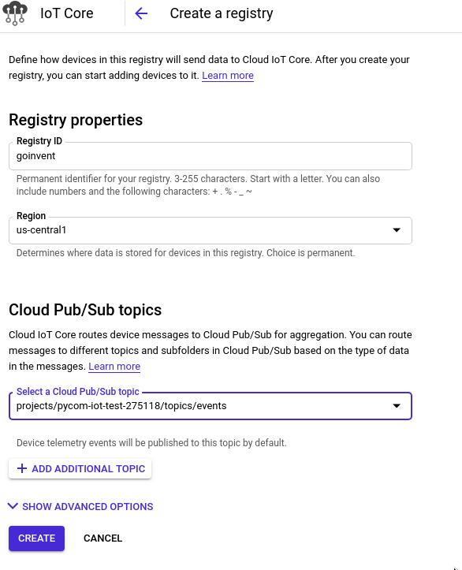
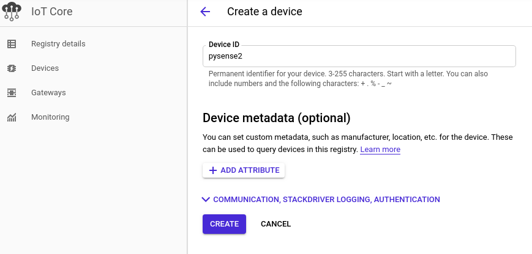
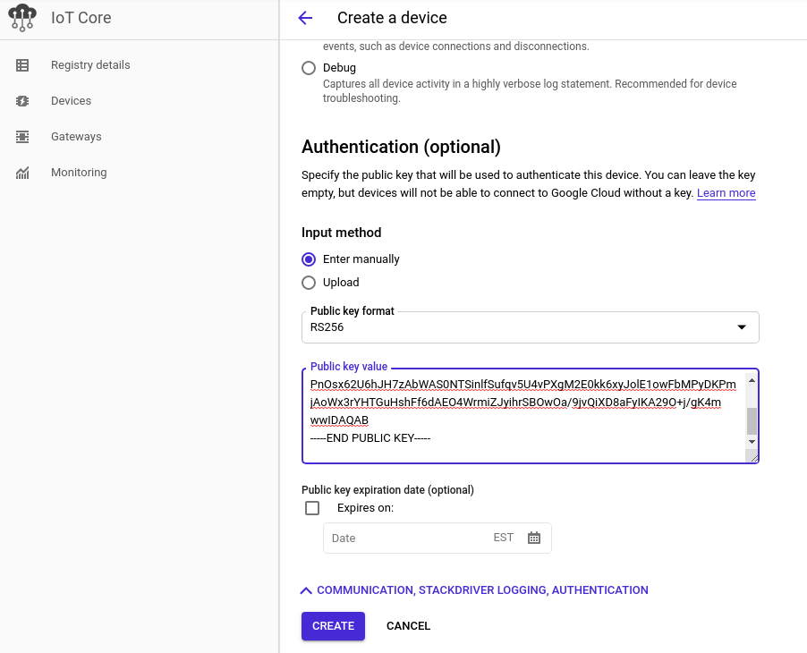

# Google Cloud Iot Core MQTT connection library

### requirement

Pycom Firmware >= 1.20.0.rc11

You will need to setup a Google IoT core registry as described here: https://cloud.google.com/iot/docs/quickstart#create_a_device_registry

During the activation please collect the following informations: 'project_id',
 'cloud_region' and 'registry_id'.

### Installation Google Cloud Platform

These are the steps to create the IoT core Registry, create a keypair, create a device, associate the keypair with the device and create the pub/sub topic in Google Cloud Platform.

#### Create a Google Cloud Platform Registry

Create a registry in the IoT core using the following properties

- Registry ID = `goinvent`
- Region = `us-central1`
- Cloud Pub/Sub topics = Create a new Cloud Pub/Sub topic = `events`
- Other settings are default

See figure for details.  For the example to work, make sure the topic is specified as ``events`.

#### Create Public/Private Keypair for Device and Associate with Registry

Using the genkey.sh script create a public/private Keypair for Device and associate the key with the device for the registry.

1. From the IoT Core section of Google Cloud Platform, click 'Devices' in the left hand sidebar.
2.  Click `CREATE A DEVICE`
3.  Specify Device ID = `pysense2`
    
    

4. In terminal create the public/private key.  The device name given as a parameter to the script should match the name of the Device ID in step 3.
    `GoogleIOT$ ./genkey.sh pysense2`
4.  Click `COMMUNICATION, STACKDRIVER LOGGING, AUTHENTICATION`
5.  In the Authentication (optional) Input method select `Enter manually`
6.  In the `Public key format` ensure the setting is `RSA256`
7.  In the terminal, select the genkey.sh output for the publick key.  Make sure to copy the text lines with `BEGIN` and `END`.  Paste this text in the edit box on Google Cloud Platform for the `Public key value`
8.  Other settings are default.

        

#### References for Google Cloud Platform

- Creating a device registry:

    https://cloud.google.com/iot/docs/quickstart#create_a_device_registry
- Adding the public key to Google IoT Core:

    https://cloud.google.com/iot/docs/quickstart#add_a_device_to_the_registry

### Usage of Pycom Code 

Assuming you have setup the Google Cloud Project as above.

- copy config.example.py to config.py and edit the variables:
    - `wifi_ssid`
    - `wifi_password`
    - `project_id`

The steps in the google cloud project assume you are using a device name of `pysense2`.  If a different name is provided in the google cloud setup portion then you will need to modify the device name in config.py accordingly.  The topic needs to be event so that the sample code will read the device configuration and upload/publish to the events topic in pub/sub.  Changing the topic name to something other than `events` breaks receipt of the configuration read message in the python code on the pycom device.

- In atom, open the project at the `flash` folder.
    
- upload the project using pymakr

